# 电机控制系统仿真实验报告

<center><div style='height:2mm;'></div><div style="font-family:华文楷体;font-size:14pt;">姓名：王一然   </div></center>
<center><span style="font-family:华文楷体;font-size:9pt">哈尔滨工程大学创梦之翼战队，电控组，邮箱：flipped1024@outlook.com<br /></span>

本报告中涉及的全部代码已上传至GitHub仓库：

[whois123/Control_Theory_Learning_Archive: My Control Theory Learning Archive](https://github.com/whois123/Control_Theory_Learning_Archive)

## 八字方针：建模 分析 设计 校验

### 一、建模

#### 1.1 确定传递函数形式

本实验研究对象为电压驱动的直流电机系统。

**推导过程写在第五章**

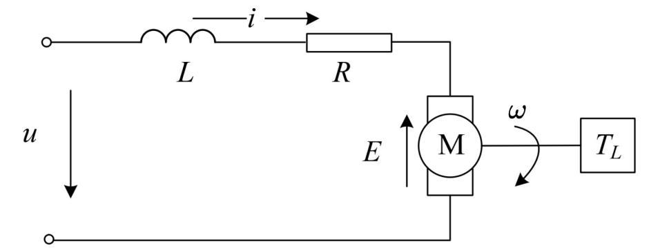

#### <font color=Green>1.2 确定传递函数参数</font>

实验法测得：

近似一阶系统，K =1，τ = 0.14s

反编译获得准确值：

二阶系统，ω_n = 39.4rad/s，ζ = 2.85

### 二、分析

#### <font color=Green>2.1 系统开环传递函数根轨迹</font>

##### 实验法测得的一阶系统传递函数分析：

开环传递函数：G(s)= K / τs+1 = 1 / 0.14s + 1

闭环特征方程：0.14s+1+K=0	解得s =-(1+K) / 0.14

根轨迹起点：K = 0	s = -7.14

​			终点：K→∞	s→−∞	

MATLAB绘制根轨迹如下：

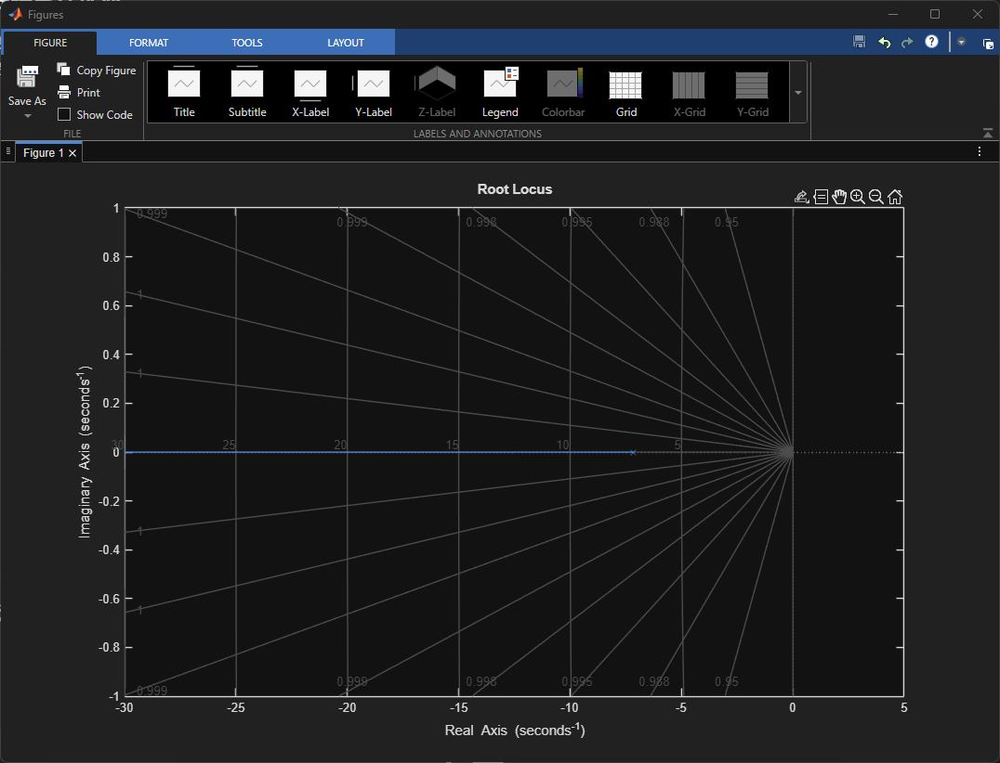

**开环极点：**

s = -7.14，在左半平面，开环系统稳定

**开环带宽：**

ω ≈ 1 / τ = 7.14 rad/s

说明系统响应较慢，本体带宽有限

**开环系统描述：**

只有一个实极点	-->	一阶系统

无零点	-->	不会振荡

无复极点	-->	不会超调

##### 准确传递函数二阶系统分析：

G(s) = 1.267 / 0.000645s² + 0.1449s + 1

计算得：开环极点2个：s1 = -7.13，s2 = -217.5	开环零点0个

MATLAB绘制根轨迹如下：

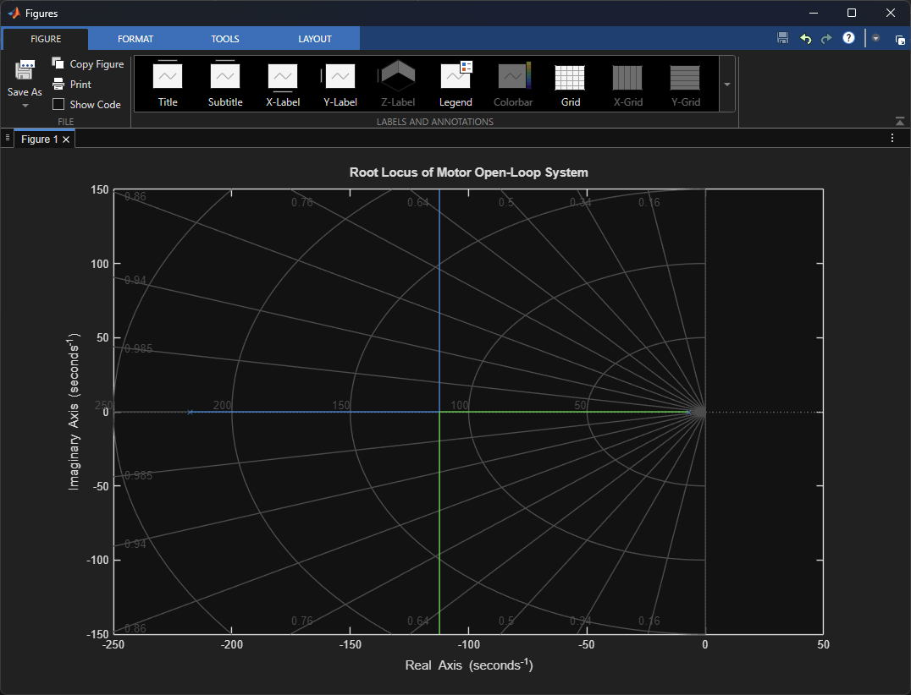

闭环系统：L(s)=KG(s)

特征方程：1+KG(s)=0	0.000645s2+0.1449s+1+1.267K=0

随着 K 增大，两个实极点向中间移动，系统从过阻尼状态逐渐变为欠阻尼状态

#### <font color=Green>2.2 系统开环传递函数伯德图</font>

##### 实验法测得的一阶系统传递函数分析：

频率响应表达式：G(jω) = 1 / 1 + j * 0.14ω

幅值：∣G(jω)∣ = 1 / √1+(0.14ω)²

相位：∠G(jω) = −arctan(0.14ω)

截止频率：ω_c = 1 / τ = 1 / 0.14=7.14 rad/s

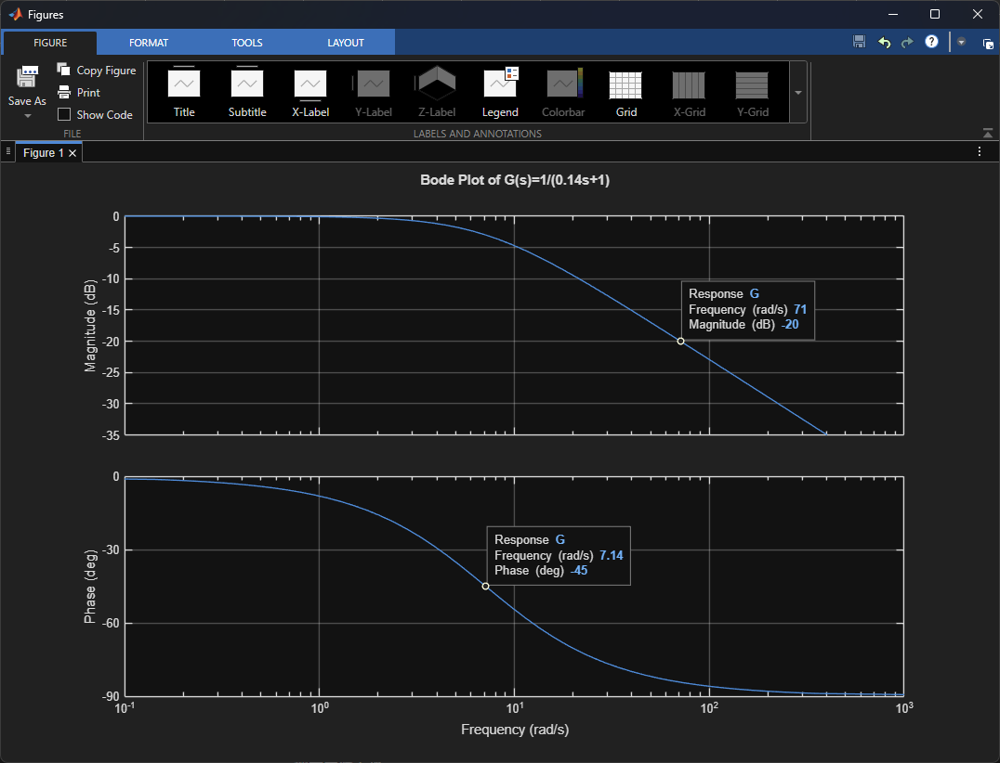

**幅频特性分析**

低频（ω≪7.14）：幅值 ≈ 0 dB

高频（ω≫7.14）：衰减率 = -20 dB/dec

**相频特性分析**

低频：相位 ≈ 0°

ω=7.14：相位 = -45°

高频：相位 → -90°

系统高频衰减仅-20dB/dec，中低频段相位下降较快，抗扰能力不足。

##### 准确传递函数二阶系统分析：

二阶系统标准形式：G(s) = 1550 / s²+224.6s+1550

ω_n = 39.4rad/s，ζ = 2.85

过阻尼系统

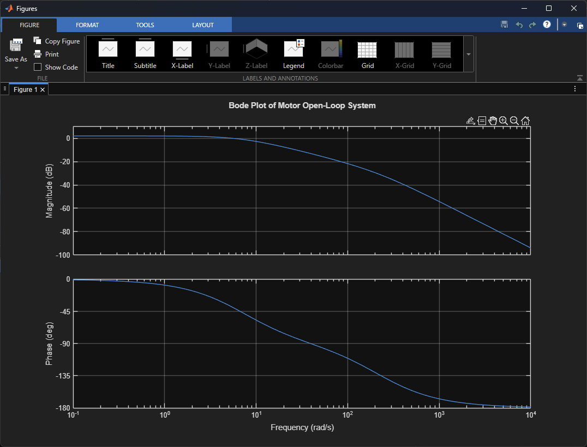


**这表明仅依靠开环系统难以满足快速性与稳定性的综合要求，需要引入反馈控制器对系统性能进行改善。**

### 三、设计

#### 3.1 PID控制器的数学表达式

##### **标准PID**

连续时间微分方程：

u(t) = K_p * e(t) + K_i *  ∫ e(t) dt + K_d * dt/de(t)

连续时间传递函数：

u(s) = K_p + K_i / s + K_d * s

离散化差分方程：

u(n) = K_p * e(n) + K_i * ∑e(i) + K_d * (e(n) - e(n - 1))

缺点：积分易饱和，微分易爆炸

##### 我采用的改进PID

条件积分抗积分饱和，微分先行抗微分爆炸

e(k) = r(k) - y(k)	

I(k) = I(k-1) + T * e(k)	//前向欧拉法离散化微分

//对反馈值微分，防止期望大幅变化时微分爆炸。在期望快速变化时有显著区别。

u(k) = K_p * e(k) + K_i * I(k) - K_d * (y(k) - y(k-1)) / T

//条件积分

当输出饱和且误差方向有助于脱离饱和时开启积分，否则关闭积分

#### 3.2 控制器C语言代码

```c
typedef struct
{
    float Kp;
    float Ki;
    float Kd;

    float integral;
    float last_error;
    float last_fdb;

    float max_output;
    float min_output;
    
    float delta_time;
    float output;
} PID_t;

void PID_Init(PID_t *pid, float Kp, float Ki, float Kd, float min_output, float max_output)
{
    pid->Kp = Kp;
    pid->Ki = Ki;
    pid->Kd = Kd;
    pid->min_output = min_output;
    pid->max_output = max_output;
    pid->integral = 0.0f;
    pid->last_error = 0.0f;
    pid->last_fdb = 0.0f;
    pid->delta_time = 0.001f;  // 1ms
    pid->output = 0.0f;
}

float PID_Calculate(PID_t *pid, float ref, float fdb, float dt)
{
    if (dt <= 0.0f)
        dt = 1e-6f;

    if (dt > 0.01f)
        dt = 0.01f;

    float error = ref - fdb;

    // ========= 对测量微分 =========
    // 避免期望阶跃造成微分爆炸
    float derivative = -(fdb - pid->last_fdb) / dt;

    float new_integral = pid->integral + error * dt;

    float output = pid->Kp * error
                 + pid->Ki * new_integral
                 + pid->Kd * derivative;

    if (output > pid->max_output)
    {
        output = pid->max_output;

        if (error < 0)
            pid->integral = new_integral;
    }
    else if (output < pid->min_output)
    {
        output = pid->min_output;

        if (error > 0)
            pid->integral = new_integral;
    }
    else
    {
        pid->integral = new_integral;
    }

    pid->last_error = error;
    pid->last_fdb   = fdb;
    pid->delta_time = dt;
    pid->output     = output;

    return output;
}
```

#### <font color=Green>3.3 加入控制器后的simulink仿真结构图</font>
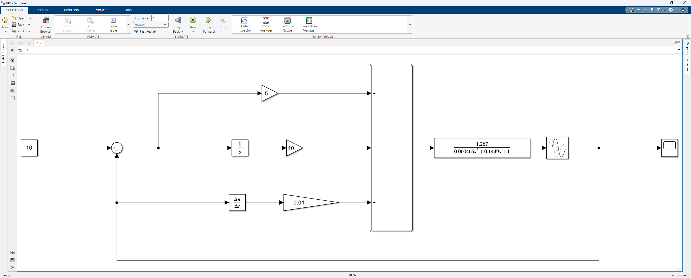

采用的微分先行PID，对测量值进行微分，所以不同于常规PID的D项与P和I并联，这里的D项连接在了反馈值y(t)上

#### <font color=Green>3.4 simulink仿真结果</font>

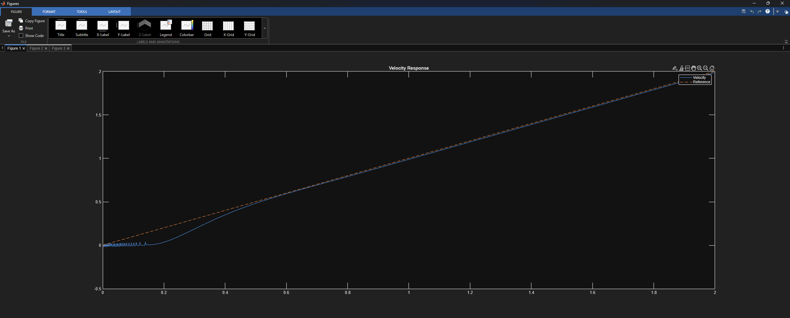

为了更直观的展示，采用.m文件进行速度单环PID的斜坡相应展示

### 四、校验（最重要）

#### 4.1 速度闭环

##### （1）系统框图

##### （2）关键代码

```c
//期望生成
void Generate_Reference(float t)
{
  float omega = 36.0f;

  switch(TestMode)
  {
    // ================= 速度环 =================
    case VEL_STEP:
      VelocityRef = 10.0f;
      break;

    case VEL_RAMP:
      VelocityRef = t;
      break;

    case VEL_SINE:
      VelocityRef = 10.0f * sinf(omega * t);
      break;
  }
//内环速度环初始化
PID_Init(&VelocityPID,
          5.0f,      // Kp
          40.0f,     // Ki
          0.01f,     // Kd
          -24.0f,     // min_output
          24.0f);    // max_output
//while循环中，非核心部分略
Current  = Get_Motor_Current(&Motor);

VelocityRaw = Get_Motor_Velocity(&Motor);
// 一阶低通滤波
VelocityFiltered = (1.0f - VelFilterAlpha) * VelocityFiltered
                      + VelFilterAlpha * VelocityRaw;

Velocity = VelocityFiltered;

Generate_Reference(t);
//模式选择，枚举略
		// ========= 速度闭环 =========
        case VEL_STEP:
        case VEL_RAMP:
        case VEL_SINE:

            Input = PID_Calculate(&VelocityPID,
                                  VelocityRef,
                                  Velocity,
                                  dt);
            break;
```

##### （3）阶跃响应时域图

速度期望为10rad/s,

延迟时间0.030s，

上升时间为0.071s，

峰值时间0.312s，

最大超调量0.8%，

调节时间0.534s

delta小于1%，可认为无稳态误差

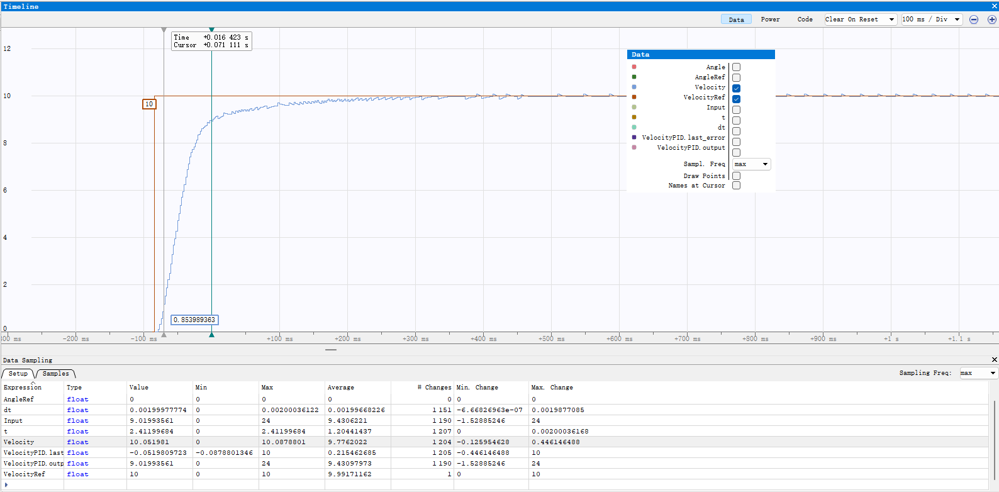

##### （4） 斜坡响应时域图

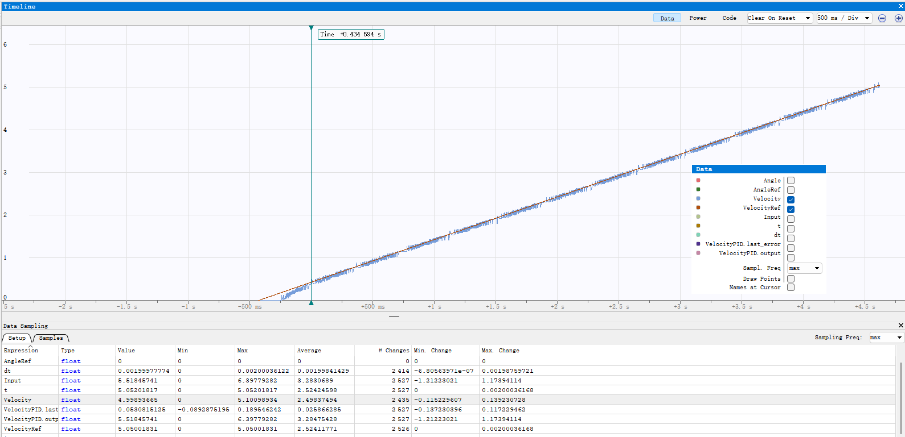

##### （5）频率响应时域图

实验法得，当ω=36.0f时，ω能使输出的振幅为系统输入振幅的 0.707 倍

其中t_r = 0.071s，ω_bp≈1.8/t_r≈25.35，满足截止频率大于25rad/s

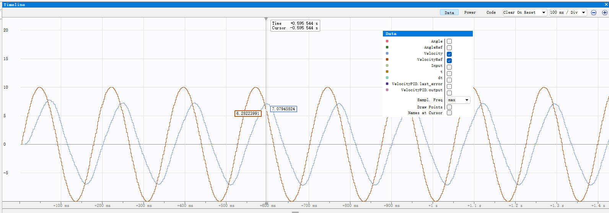

#### 4.2 角度闭环

##### （1）系统框图

##### （2）关键代码

```c
//期望生成
void Generate_Reference(float t)
{
  float omega_ang = 4.8f;
  float omega_cas = 5.5f;

  switch(TestMode)
  {
    // ================= 角度单环 =================
    case ANG_SINGLE_STEP:
      AngleRef = 2.0f * 3.1415926f;
      break;

    case ANG_SINGLE_SINE:
      AngleRef = 2.0f * 3.1415926f * sinf(omega_ang * t);
      break;
  }
}
//单角度环时，pid参数
PID_Init(&AnglePID,
          3.0f,      // Kp
          0.13f,      // Ki
          0.0f,      // Kd
          -20.0f,     // min velocity ref
          20.0f);    // max velocity ref
//串级pid时，角度外环pid参数
PID_Init(&AnglePID,
          30.0f,      // Kp
          0.0f,      // Ki
          0.27f,      // Kd
          -20.0f,     // min velocity ref
          20.0f);    // max velocity ref

//while循环中，非核心部分略
	Angle    = Get_Motor_Angle(&Motor);
    Generate_Reference(t);

//模式选择，枚举略
		// ========= 单级角度 =========
        case ANG_SINGLE_STEP:
        case ANG_SINGLE_SINE:

            Input = PID_Calculate(&AnglePID,
                                  AngleRef,
                                  Angle,
                                  dt);
            break;

        // ========= 串级控制 =========
        case ANG_CAS_STEP:
        case ANG_CAS_SINE:
        case ANG_DISTURBANCE:

            VelocityRef = PID_Calculate(&AnglePID,
                                        AngleRef,
                                        Angle,
                                        dt);

            Input = PID_Calculate(&VelocityPID,
                                  VelocityRef,
                                  Velocity,
                                  dt);
            break;


// ===== 扰动测试 =====
        if(TestMode == ANG_DISTURBANCE)
        {

            switch (DisturbanceControlMode)
            {
                case MODE_ANG_SINGLE:

                    Input = PID_Calculate(&AnglePID,
                                          AngleRef,
                                          Angle,
                                          dt);
                    break;

                case MODE_ANG_CAS:
                    VelocityRef = PID_Calculate(&AnglePID,
                                                AngleRef,
                                                Angle,
                                                dt);

                    Input = PID_Calculate(&VelocityPID,
                                          VelocityRef,
                                          Velocity,
                                          dt);
                    break;
            }

            if(t > 0.5f && t < 0.7f)
                Input += 10.0f;

        }
```

##### （3）阶跃响应时域图

#### 角度单环

角度期望为2π rad,

延迟时间0.274s，

上升时间为0.441s，

峰值时间0.750s，

最大超调量0.3%，

调节时间0.750s

delta小于1%，可认为无稳态误差

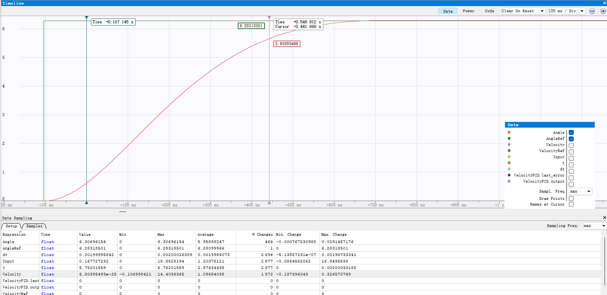

#### 串级PID

角度期望为2π rad,

延迟时间0.220s，

上升时间为0.274s，

峰值时间0.427s，

最大超调量0.16%，

调节时间0.427s

delta小于1%，可认为无稳态误差

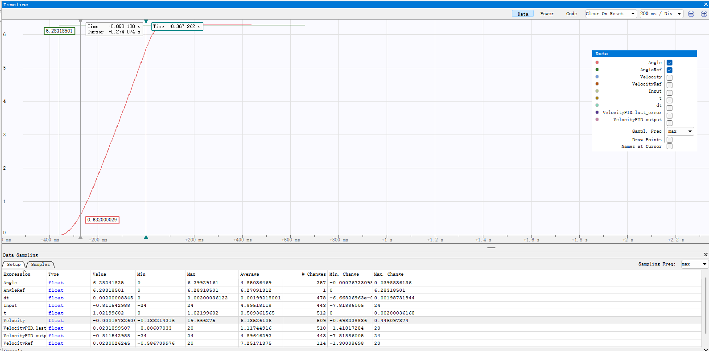

##### （4）频率响应时域图

#### 角度单环

实验法得，当ω=4.8f时，ω能使输出的振幅为系统输入振幅的 0.707 倍																																																																																																																																																																							

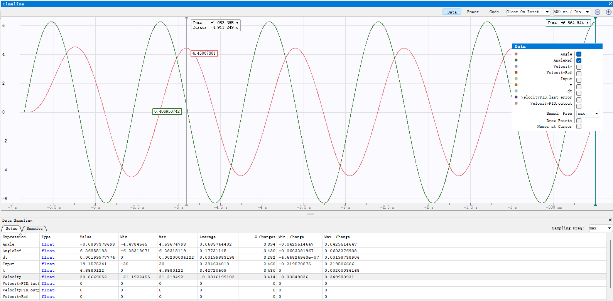

#### 串级PID

实验法得，当ω=5.5f时，ω能使输出的振幅为系统输入振幅的 0.707 倍

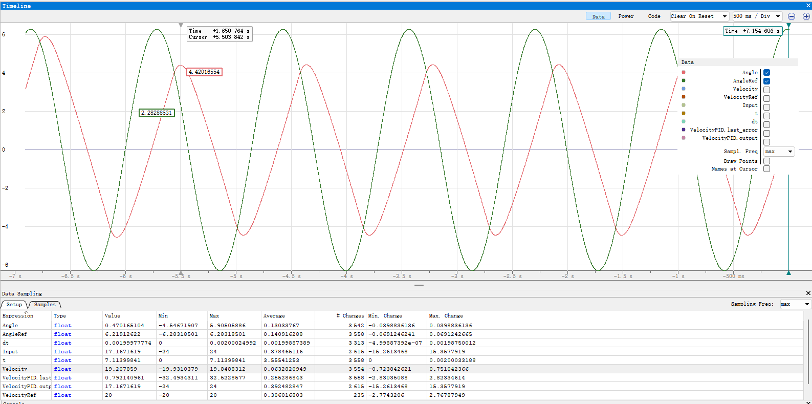

##### （5）抗干扰性能时域图

0.5s至0.7s时加入Input=10v扰动输入。

#### 角度单环

在与角度单环阶跃响应时相同的PID参数下，用时约38秒，角度才降至0.01rad以下。

可见，角度单环PID抗干扰性能非常差。

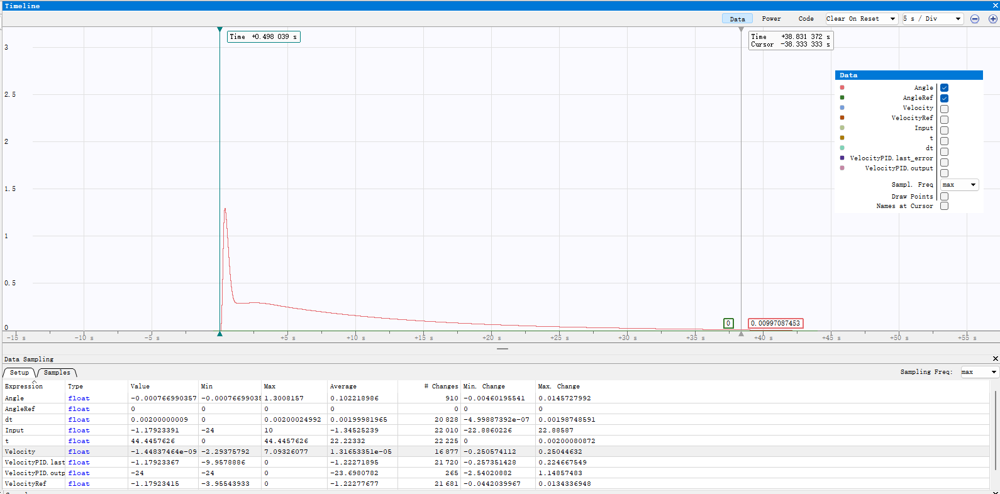

#### 串级PID

在与串级PID阶跃响应时相同的PID参数下，用时仅0.370秒，角度就已降至0.01rad以下。

且0.612秒后就能达到角度期望0rad。

可见，串级PID的抗干扰性能比较理想。

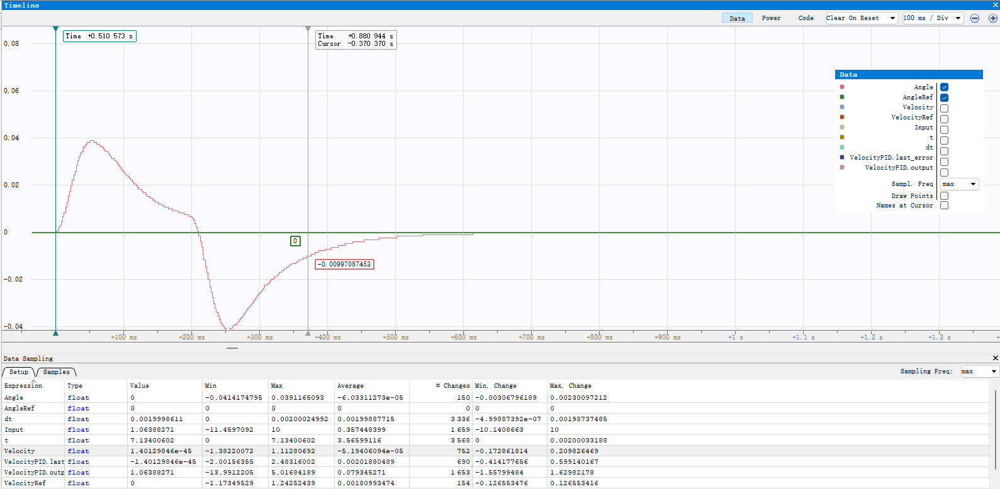


### 五、扩展内容

### <font color=Green>1、推导该电机系统的传递函数</font>

##### 传递函数推导

选取电机输入电压 U(t) 作为系统输入，选取电机角速度 w(t) 作为系统输出。

在忽略负载转矩的情况下，电机的数学模型可由电气方程与机械方程共同描述。

电气部分根据基尔霍夫电压定律可得：

U(t) =R * i(t) + L * di(t)/dt + K_e * w(t)

其中，R 为电枢电阻，L 为电枢电感，K_e 为反电动势系数，i(t) 为电枢电流。

机械部分根据转动定律可得：

J * d w(t) / dt + b * w(t) = Kt * i(t)

其中，J 为转动惯量，b 为粘性摩擦系数，Kt 为电磁转矩常数。

在零初始条件下对上述微分方程进行拉普拉斯变换，并消去中间变量 I(s)，可得到电机角速度关于输入电压的传递函数：

G(s) = W(s) / U(s) = K_t/J * L² +(J * R +L * b) * s + (R * b + K_c * K_t)

由此可见，该电机模型为严格二阶系统，其动态特性由电气参数、机械参数以及电磁耦合项共同决定。

**BUT ！！！**

根据实验测量，该仿真电机模型在开环条件下，输出上升曲线无明显波动，

可以认为L << R，

消去所有含L项，近似认为该电机为一阶系统，传递函数：

G(s) = W(s) / U(s) = K_t/ J * R * s + (R * b + K_c * K_t)

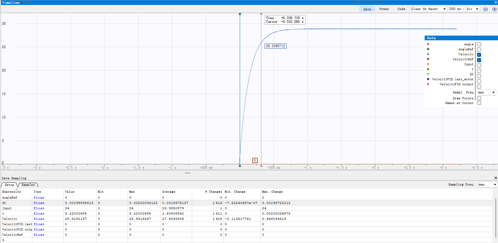

##### 传递函数参数

实验法测量

**实验条件**

控制模式：开环控制

系统输入：Input = 24.0v

**实验数据**

稳态速度 ω_∞ ≈ 28.9 rad/s

上升时间≈ 0.310s

上升到τ时间 t ≈ 0.145s

**参数计算**

K = ω_∞ / U_0 = 28.9/24 = 1.20

一阶系统：ω(t)=K * U0(1−e−t/τ) 	

当ω=0.63ω_∞，即t = τ时，t = τ = 0.145s

**得到一阶模型：**G(s)= K / τs+1 = 1.2 / 0.145s + 1

# **BUT！！！**

如此草率的粗略计算，并不能准确的获得电机传递函数参数。

So，为了获得更准确的电机参数值，我对lib进行了反编译，并运用电机建模与实验法准确的找出了反编译程序中各项电机参数的数值如下：

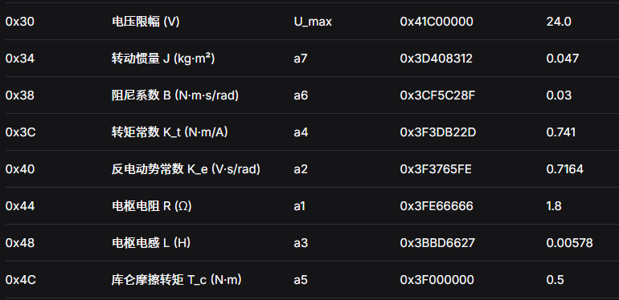

在MATLAB中模拟开环情况，与单片机仿真几乎无差别

下图为Input = 24v时，ozone与MATLAB中的速度曲线：

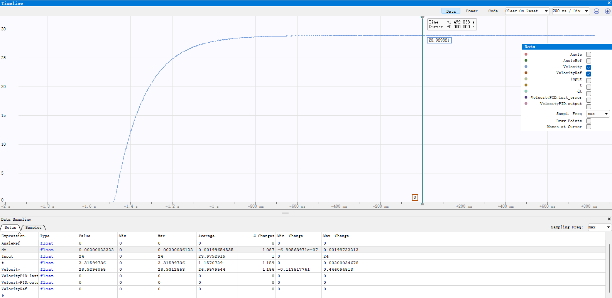

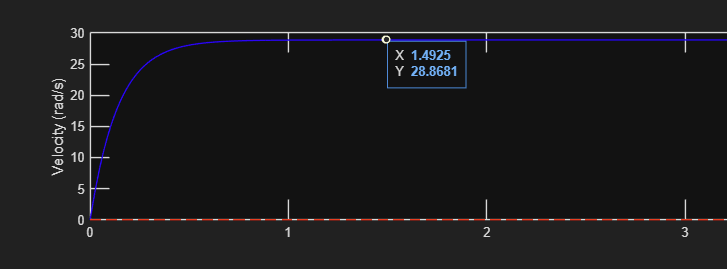

整理数据，得出该电机的准确传递函数为：

G(s) = 1.267 / 0.000645s² + 0.1449s + 1

可见，前文估算的一阶系统差别不大

化为二阶系统标准形式：

G(s) = 1550 / s²+224.6s+1550

前文simulink模型搭建中采用该传递函数

### <font color=Green>2、复合控制</font>

#### <font color=Green>2.1 控制器设计</font>

#### **前馈**

根据先前得出的电机参数，可知系统中存在K_e	b	T_c

**故设计前馈,思路如下：**

已知电机方程：

U(t) =R * i(t) + L * di(t)/dt + K_e * w(t)

J * d w(t) / dt + b * w(t) + T_c * sign(w) = Kt * i(t)	//sign()为符号函数

所以U_ff = R * I_ff + L * dI_ff(t)/dt + K_e * w

传递函数：G_ff(s) = (LJ / K_t) * s²  +  ((L * b + R * J) / K_t) * s  +  (R * b / K_t + K_e)

设计控制器如下

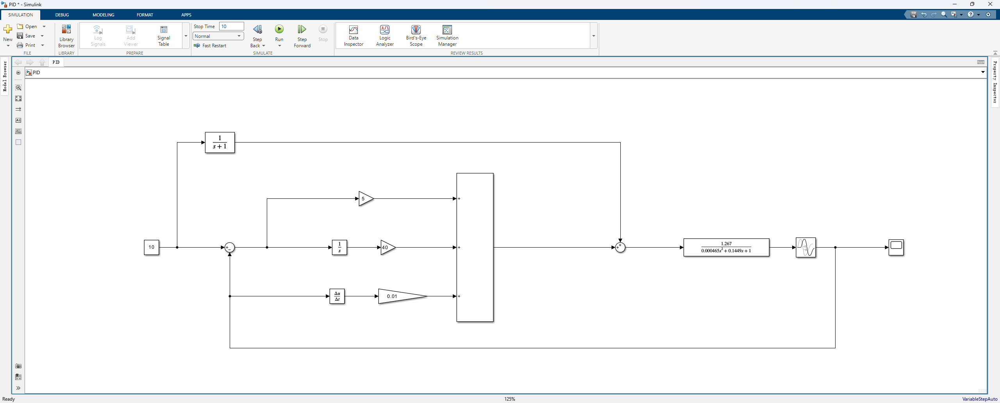

#### <font color=Green>2.2 关键代码</font>

```c
#include "Motor_FeedForward.h"
#include <math.h>

static float clamp(float x, float min, float max)
{
    if (x > max) return max;
    if (x < min) return min;
    return x;
}

float Motor_FeedForward(
    motorObject_t *motor,
    float omega_ref,
    float omega_ref_last,
    float omega_ref_last2,
    float dt,
    float maxAcc,
    float maxJerk)
{
    if (dt <= 0.0f)
        dt = 1e-6f;

    // ===== 电机参数 =====
    float J  = motor->motorParam.J;
    float b  = motor->motorParam.b;
    float Kt = motor->motorParam.Kt;
    float Ke = motor->motorParam.Ke;
    float R  = motor->motorParam.R;
    float L  = motor->motorParam.L;
    float Tc = motor->motorParam.constFriction;

    // ===== 一阶导数 =====
    float domega = (omega_ref - omega_ref_last) / dt;
    domega = clamp(domega, -maxAcc, maxAcc);

    // ===== 二阶导数 =====
    float ddomega = (omega_ref - 2.0f*omega_ref_last + omega_ref_last2) / (dt * dt);
    ddomega = clamp(ddomega, -maxJerk, maxJerk);

    // ===== 平滑库仑摩擦 =====
    float sign = tanhf(omega_ref * 50.0f);

    // ===== 前馈电流 =====
    float I_ff =
        (J * domega
        + b * omega_ref
        + Tc * sign)
        / Kt;

    // ===== 电流导数 =====
    float dI_ff =
        (J * ddomega
        + b * domega)
        / Kt;

    // ===== 完整电压前馈（含 L 项）=====
    float u_ff =
        L * dI_ff
        + R * I_ff
        + Ke * omega_ref;

    return u_ff;
}

```

#### <font color=Green>2.3 效果展示</font>

（1）角度闭环阶跃响应

角度期望为2π rad,

延迟时间0.211s，

上升时间为0.259s，

峰值时间0.397s，

最大超调量0.012%，

调节时间0.397s

较无前馈情况均有所提升

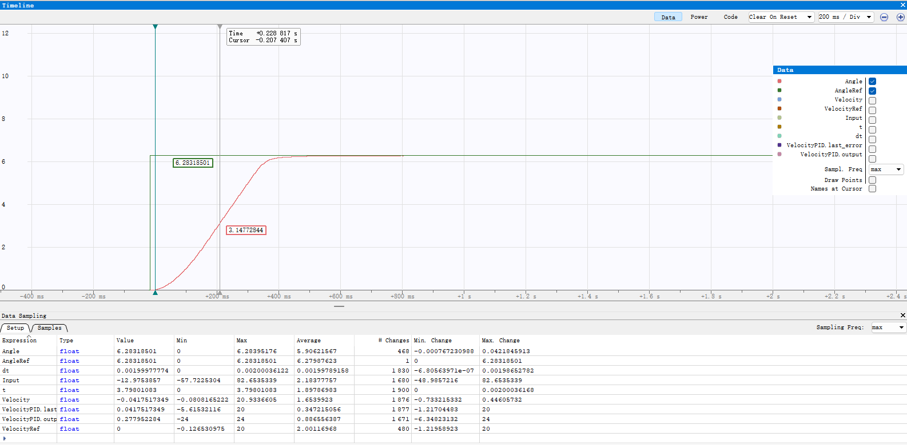

（2）角度闭环频率响应

当ω=5.8f时，ω能使输出的振幅为系统输入振幅的 0.707 倍

较传统PID，w提升0.3

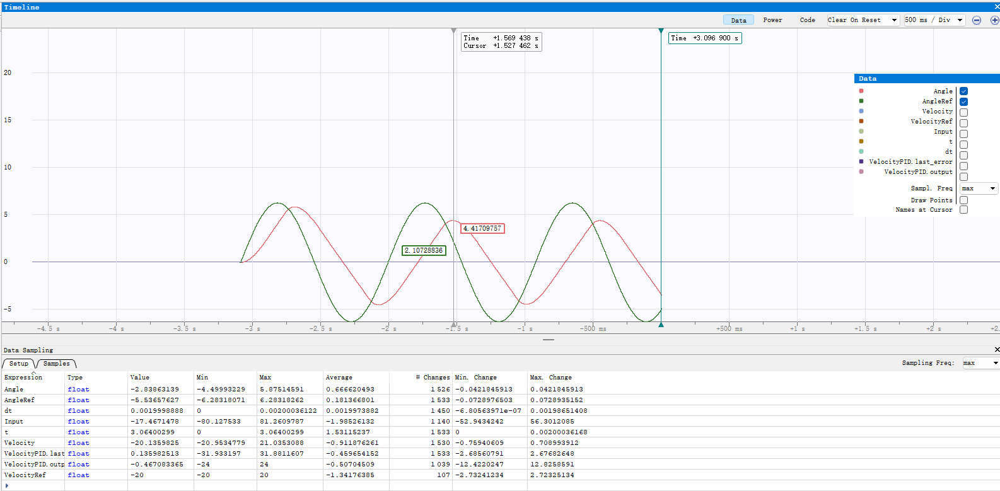

（3）角度闭环抗干扰性能

相同参数下，产生小幅振荡，效果不理想

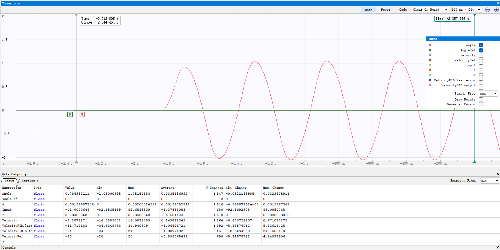

### <font color=Green>3、滤波</font>

设计时已加入一阶低通滤波，代码如下：

```c
  VelocityFiltered = (1.0f - VelFilterAlpha) * VelocityFiltered\+ VelFilterAlpha * VelocityRaw;
```

